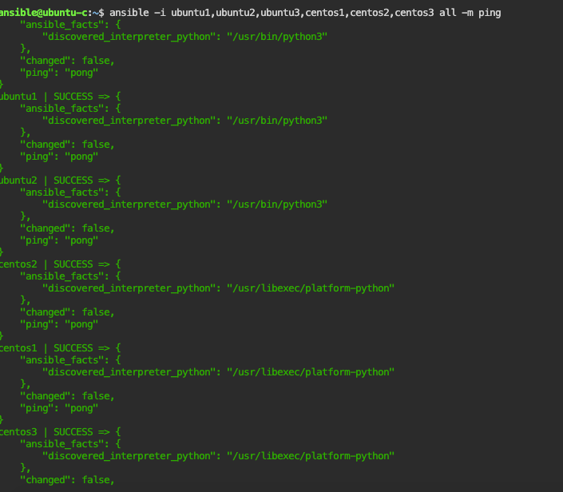

####  <p style="color:orange;">I - Ansible Repos </p>

* [ansible-lab](https://github.com/spurin/diveintoansible-lab.git)

* [ansible-course](https://github.com/spurin/diveintoansible)


1-What is ansible ?
```
Ansible is a simple IT automatisation engines that automates cloud provising, configuration management, deployment, intra-service orchestration, and many other IT needs.
```
2-Get help from ansible ?

```
ansible --help | more
```

####  <p style="color:orange;">II - Ansible ubuntu-c</p>
* <p style="color:pink;">Access ubuntu-c terminal terminal</p>

```
1-navigate to localhost:1000/
2-Click Ansible terminal
3-In the shell appearing terminal, enter 'ubuntuc-login': ansible, 'password': 'password'
```
--> Returns

<br/>
</br>

* <p style="color:pink;">Try ssh connection towards ubuntu1 remotes server and understand  fingerPrints inside ubuntu-c known_hosts file </p>

```
ssh ubuntu1
```
this will ask fingerPrint: so say yes

```
The authenticity of host 'ubuntu1 (172.18.0.4)' can't be established.
ECDSA key fingerprint is SHA256:sof4vYyG3nbml20BIcqvU8v6iJ5qCvHFrP+QouKkaA8.
Are you sure you want to continue connecting (yes/no/[fingerprint])? yes
```

Now the fingerPrint will be write inside ubuntu-c known_hosts file.Let's check it.
Write exit to go back to ubuntu-c
```
cat .ssh/known_hosts
```
--> Returns the fingerPrints content captured from both ubuntu1 hostname and IPAddress

```
Fingerprint_from_hostname:  |1|XjeQeFFNiXtsZsvxylqYVoP2XOM=|7C1kz4ArSLFwf3o8oCy7KjLPkBc= ecdsa-sha2-nistp256 AAAAE2VjZHNhLXNoYTItbmlzdHAyNTYAAAAIbmlzdHAyNTYAAABBBMI4Tq3BI72qGCVpWeS07dIAzYjEuBXV1NlXzxmqcTMMczp1ENyyJaqbZ+sdt3EdlFjnuR1ToFQLVDAqhNYdC+M=
```

```
Fingerprint_from_IPADDRESS: |1|Ufr70+ybMrP7y7pL/crm8g2mLUE=|yjWo79VNc2xKn6df8uXqcGNZEGM= ecdsa-sha2-nistp256 AAAAE2VjZHNhLXNoYTItbmlzdHAyNTYAAAAIbmlzdHAyNTYAAABBBMI4Tq3BI72qGCVpWeS07dIAzYjEuBXV1NlXzxmqcTMMczp1ENyyJaqbZ+sdt3EdlFjnuR1ToFQLVDAqhNYdC+M=
```

To prove that, let's catch fingerPrint from ubuntu1 hostname (outside it):
```
ssh-keygen -H -F ubuntu1
```
-->Returns
```
|1|XjeQeFFNiXtsZsvxylqYVoP2XOM=|7C1kz4ArSLFwf3o8oCy7KjLPkBc= ecdsa-sha2-nistp256 AAAAE2VjZHNhLXNoYTItbmlzdHAyNTYAAAAIbmlzdHAyNTYAAABBBMI4Tq3BI72qGCVpWeS07dIAzYjEuBXV1NlXzxmqcTMMczp1ENyyJaqbZ+sdt3EdlFjnuR1ToFQLVDAqhNYdC+M=
```
which is simply the ubuntu1 hostname fingerpring

let's catch fingerPrint from ubuntu1 ipAdress (outside it):
To get his IPAddress, ping the command

```
ping ubuntu1
```
--> Returns 172.18.0.4 (hit ctrl-c to quit)
Now , use the same command with iPAdress to check that finger print second part corespond to IPAdress fingerPrint

```
ssh-keygen -H -F 172.18.0.4
```

-->Returns
```
|1|Ufr70+ybMrP7y7pL/crm8g2mLUE=|yjWo79VNc2xKn6df8uXqcGNZEGM= ecdsa-sha2-nistp256 AAAAE2VjZHNhLXNoYTItbmlzdHAyNTYAAAAIbmlzdHAyNTYAAABBBMI4Tq3BI72qGCVpWeS07dIAzYjEuBXV1NlXzxmqcTMMczp1ENyyJaqbZ+sdt3EdlFjnuR1ToFQLVDAqhNYdC+M=
```
which is the same as fingerPrint second part.


* <p style="color:pink;">Generate ssh key inside ubuntu-c and copy it inside remotes server and Try connection with many server </p>

```
ssh-keygen
```
```
apt-get install sshpass [to provide password for all remote server without writing it each time ]
```

```
sudo apt-get update
sudo apt-get install sshpass
echo 'password' > password.txt
```
```
for user in ansible root
do
  for os in ubuntu centos
  do
     for instance in 1,2,3
      do
         sshpass -f password.txt ${user}@${os}${instance}
      done
  done
done
```
Now remove the password.txt
```
rm password.txt
```
Try to connect to all of them


After, if you try to connect, you won't be ask for password or fingerPrint accept.

<br/>
</br>

####  <p style="color:orange;">III - Ansible Configuration </p>

```
ansible --version
```
```
ansible [core 2.11.2]
  config file = None
  configured module search path = ['/home/ansible/.ansible/plugins/modules', '/usr/share/ansible/plugins/modules']
  ansible python module location = /usr/local/lib/python3.8/dist-packages/ansible
  ansible collection location = /home/ansible/.ansible/collections:/usr/share/ansible/collections
  executable location = /usr/local/bin/ansible
  python version = 3.8.5 (default, May 27 2021, 13:30:53) [GCC 9.3.0]
  jinja version = 3.0.1
  libyaml = True
```
Create ansible configuration file

```
su -
mkdir /etc/ansible
touch /etc/ansible/ansible.cfg
```
Now run again
```
ansible --version
```
```
ansible@ubuntu-c:~$ ansible --version
ansible [core 2.11.2]
  config file = /etc/ansible/ansible.cfg
  configured module search path = ['/home/ansible/.ansible/plugins/modules', '/usr/share/ansible/plugins/modules']
  ansible python module location = /usr/local/lib/python3.8/dist-packages/ansible
  ansible collection location = /home/ansible/.ansible/collections:/usr/share/ansible/collections
  executable location = /usr/local/bin/ansible
  python version = 3.8.5 (default, May 27 2021, 13:30:53) [GCC 9.3.0]
  jinja version = 3.0.1
  libyaml = True
```
If we created a file called  .ansible.cfg file (in home directory aka ansible@ubuntu-c without being super-user), it will have prior priority than the previous one.

```
ansible@ubuntu-c:~$ ansible --version
ansible [core 2.11.2]
  config file = /home/ansible/.ansible.cfg
  configured module search path = ['/home/ansible/.ansible/plugins/modules', '/usr/share/ansible/plugins/modules']
  ansible python module location = /usr/local/lib/python3.8/dist-packages/ansible
  ansible collection location = /home/ansible/.ansible/collections:/usr/share/ansible/collections
  executable location = /usr/local/bin/ansible
  python version = 3.8.5 (default, May 27 2021, 13:30:53) [GCC 9.3.0]
  jinja version = 3.0.1
  libyaml = True
```
####  <p style="color:orange;">IV - Ansible Inventories </p>
In the git repos (see above),

<p style="color:grey">cd /diveintoansible/Ansible Architecture and Design/Inventories/01</p>

```
ls --> ansible.cfg, hosts
cat ansible.cfg
     --> [defaults]
         inventory=hosts
cat hosts:
         [all]
         centos
```
ansible -m ping
```
centos1 | SUCCESS => {
    "ansible_facts": {
        "discovered_interpreter_python": "/usr/libexec/platform-python"
    },
    "changed": false,
    "ping": "pong"
}
```
If you remove known_hosts file, and try to execute ansible all -m ping, it will ask for fingerPrint , to prevent that question
use ENVIRONMENT_VARIABLE
```
ANSIBLE_HOST_KEY_CHECKING=False ansible all -m ping
```

<p style="color:grey">cd /diveintoansible/Ansible Architecture and Design/Inventories/02</p>
```
ls ---> ansible.cfg, hosts
cat ansible.cfg
    [defaults]
    inventory=hosts
    host_key_checking = False
cat hosts
    [all]
    centos
```
with the adding key host_key_checking = False, remove known_hosts file ,we can try connection and we will not be ask for fingerPrint.

```
ansible all -m ping
```

<p style="color:grey">cd /diveintoansible/Ansible Architecture and Design/Inventories/03</p>

```
ls ---> ansible.cfg, hosts
cat ansible.cfg
    [defaults]
    inventory=hosts
    host_key_checking = False
cat hosts
    [centos]
    centos1
    centos2
    centos3

    [ubuntu]
    ubuntu1
    ubuntu2
    ubuntu3
```
try to connect differently,with all, or by group centos, ubuntu
```
ansible all -m ping [for all group]
ansible "*" -m ping -o [for  all group but result in inline]
ansible centos -m ping [for only centos group]
ansible centos1 -m ping -o [for only centos1]
ansible ubuntu -m ping [for only ubuntu group]
ansible centos --list-hosts[to list all centos group servers]
ansible ubuntu --list-hosts
ansible all --list-hosts
ansible ~.*3 --list-hosts [dot means any caracter and start means any number ending with]
```

<p style="color:grey">cd /diveintoansible/Ansible Architecture and Design/Inventories/04</p>

```
ls ---> ansible.cfg, hosts
cat ansible.cfg
    [defaults]
    inventory=hosts
    host_key_checking = False
cat hosts
    [centos]
    centos1 ansible_user = root
    centos2 ansible_user = root
    centos3 ansible_user = root

    [ubuntu]
    ubuntu1
    ubuntu2
    ubuntu3
```

<br/>
</br>
to be sure centos[1..3] have been executed by user root :

```
ansible all -m command -a 'id' -o
```
<br/>
</br>
uid=0 means root

<p style="color:grey">cd /diveintoansible/Ansible Architecture and Design/Inventories/05</p>

```
ls ---> ansible.cfg, hosts
cat ansible.cfg
    [defaults]
    inventory=hosts
    host_key_checking = False
cat hosts
    [centos]
    centos1 ansible_user = root
    centos2 ansible_user = root
    centos3 ansible_user = root

    [ubuntu]
    ubuntu1 ansible_become=true,ansible_become_pass=password
    ubuntu2 ansible_become=true,ansible_become_pass=password
    ubuntu3 ansible_become=true,ansible_become_pass=password
```
Now you can see as previously, all user are root

```
ansible all -m command -a 'id' -o
```

<br/>
</br>

<p style="color:grey">cd /diveintoansible/Ansible Architecture and Design/Inventories/06</p>

```
ls ---> ansible.cfg, hosts
cat ansible.cfg
    [defaults]
    inventory=hosts
    host_key_checking = False
cat hosts
    [centos]
    centos1 ansible_user = root ansible_por=2222
    centos2 ansible_user = root
    centos3 ansible_user = root

    [ubuntu]
    ubuntu1 ansible_become=true,ansible_become_pass=password
    ubuntu2 ansible_become=true,ansible_become_pass=password
    ubuntu3 ansible_become=true,ansible_become_pass=password
```
Go to docker-compose file and change the centos port to 2222 and comment the 22 port and uncomment spurin/diveintoansible:centos-sshd-2222 image (comment image: spurin/diveintoansible:centos image )
Then after, run

```
ansible "*" -m ping -o
```

<p style="color:grey">cd /diveintoansible/Ansible Architecture and Design/Inventories/07</p>

We change change the port notation manner like the following

```
ansible@ubuntu-c:~/diveintoansible/Ansible Architecture and Design/Inventories/07$

cat ansible.cfg
[defaults]
inventory=hosts
host_key_checking = False

cat hosts
[centos]
centos1:2222 ansible_user=root
centos2 ansible_user=root
centos3 ansible_user=root

[ubuntu]
ubuntu1 ansible_become=true ansible_become_pass=password
ubuntu2 ansible_become=true ansible_become_pass=password
ubuntu3 ansible_become=true ansible_become_pass=password
```
```
ansible all -m ping -o (will lead to sucess for all server)
```

<p style="color:grey">cd /diveintoansible/Ansible Architecture and Design/Inventories/08</p>

we can add control group
``
ansible@ubuntu-c:~/diveintoansible/Ansible Architecture and Design/Inventories/07$

```
cat ansible.cfg
[defaults]
inventory=hosts
host_key_checking = False

cat hosts
[control]
ubuntu-c ansible_connection=local

[centos]
centos1:2222 ansible_user=root
centos2 ansible_user=root
centos3 ansible_user=root

[ubuntu]
ubuntu1 ansible_become=true ansible_become_pass=password
ubuntu2 ansible_become=true ansible_become_pass=password
ubuntu3 ansible_become=true ansible_become_pass=password
```
In this case, we don't need ssh connection and feel free to read the ansible all -m ping result concerning python interpreter use in this case

<p style="color:grey">cd /diveintoansible/Ansible Architecture and Design/Inventories/09</p>
we can also use ranger

```
cat ansible.cfg
[defaults]
inventory=hosts
host_key_checking = False

cat hosts
[control]
ubuntu-c ansible_connection=local

[centos]
centos1:ansible_user=root ansible_port:2222
centos[2:3] ansible_user=root

[ubuntu]
ubuntu[1:3] ansible_become=true ansible_become_pass=password

```

list all servers to be sure all are present with ranger notation

```
ansible all --list-hosts
```
<p style="color:grey">cd /diveintoansible/Ansible Architecture and Design/Inventories/10</p>

adding group vars
```
cat ansible.cfg
[defaults]
inventory=hosts
host_key_checking = False

cat hosts
[control]
ubuntu-c ansible_connection=local

[centos]
centos1: ansible_port:2222
centos[2:3]

[centos:vars]
ansible_user=root

[ubuntu]
ubuntu[1:3]

[ubuntu:vars]
ansible_become=true
ansible_become_pass=password
```

<p style="color:grey">cd /diveintoansible/Ansible Architecture and Design/Inventories/11</p>

adding children and ping parent
```
cat ansible.cfg
[defaults]
inventory=hosts
host_key_checking = False

cat hosts
[control]
ubuntu-c ansible_connection=local

[centos]
centos1: ansible_port:2222
centos[2:3]

[centos:vars]
ansible_user=root

[ubuntu]
ubuntu[1:3]

[ubuntu:vars]
ansible_become=true
ansible_become_pass=password

[linux:children]
centos
ubuntu
```
pinging parent linux will automatically ping centos and ubuntu group

```
ansible linux -m ping
```

<p style="color:grey">cd /diveintoansible/Ansible Architecture and Design/Inventories/12</p>

Port prededency

```
cat ansible.cfg
inventory = hosts
host_key_checking = False

cat hosts
[control]
ubuntu-c ansible_connection=local

[centos]
centos1 ansible_port=2222
centos[2:3]

[centos:vars]
ansibel_user=root

[ubuntu]
ubuntu[1:3]

[ubuntu:vars]
ansible_become=true
ansible_becom_pass=password

[linus:children]
centos
ubuntu

[all:vars]
ansible_port=1234
```

all will fail except centos1 and ubuntu-c because of the precedency (priority) over all:vars port

```
ansible all -m ping
```


<p style="color:grey">cd /diveintoansible/Ansible Architecture and Design/Inventories/13</p>

Port prededency with parent linux intead of all

```
cat ansible.cfg
inventory = hosts
host_key_checking = False

cat hosts
[control]
ubuntu-c ansible_connection=local

[centos]
centos1 ansible_port=2222
centos[2:3]

[centos:vars]
ansibel_user=root

[ubuntu]
ubuntu[1:3]

[ubuntu:vars]
ansible_become=true
ansible_becom_pass=password

[linus:children]
centos
ubuntu

[linux:vars]
ansible_port=1234
```

```
ansible all -m ping
```


<p style="color:grey">cd /diveintoansible/Ansible Architecture and Design/Inventories/14</p>

the hosts file in yaml format (using the previous hosts file)

```
cat ansible.cfg
[defaults]
inventory = hosts.yaml
host_key_checking = False

cat hosts.yaml

---
control:
  hosts:
   ubuntu-c:
    ansible_connection: local

centos:
  hosts:
    centos1:
      ansible_port: 2222
    centos2:
    centos3:
  vars:
    ansible_user: root

ubuntu:
  hosts:
    ubuntu1:
    ubuntu2:
    ubuntu3:
  vars:
    ansible_become: true
    ansible_become_pass: password

linux:
  children:
    centos:
    ubuntu:
  vars:
    ansible_port: 1234

...
```

<p style="color:grey">cd /diveintoansible/Ansible Architecture and Design/Inventories/15</p>

hots in json format

try to convert yaml file into json : so run this command .

```
python3 -c 'import sys, yaml, json; json.dump(yaml.load(sys.stdin, Loader=yaml.FullLoader), sys.stdout, indent=4)' < hosts.yaml > hosts.json
```

```
cat hosts.json
{
    "control": {
        "hosts": {
            "ubuntu-c": {
                "ansible_connection": "local"
            }
        }
    },
    "centos": {
        "hosts": {
            "centos1": {
                "ansible_port": 2222
            },
            "centos2": null,
            "centos3": null
        },
        "vars": {
            "ansible_user": "root"
        }
    },
    "ubuntu": {
        "hosts": {
            "ubuntu1": null,
            "ubuntu2": null,
            "ubuntu3": null
        },
        "vars": {
            "ansible_become": true,
            "ansible_become_pass": "password"
        }
    },
    "linux": {
        "children": {
            "centos": null,
            "ubuntu": null
        }
    }
}
```

```
ansible all -m ping
```

<p style="color:grey">cd /diveintoansible/Ansible Architecture and Design/Inventories/16</p>

set ansible extra_vars to modify centos1 port

```
ansible all -m ping -e 'ansible_port=22'
```
centos1 will failed because in docker compose file it is listening on port 2222

In reverse if we set in the previous command yhe port value to 2222 , centos1 will succeed but all others will failed.
